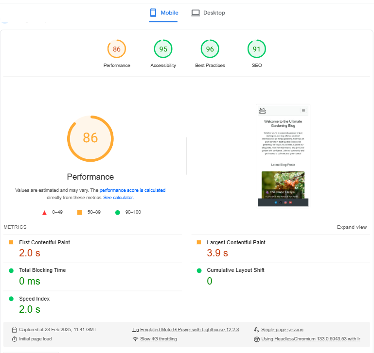

# TESTING.md

## Table of Contents

- [Manual Testing](#manual-testing)
  - [User Stories Testing](#user-stories-testing)
- [Lighthouse Testing](#lighthouse-testing)
  - [Mobile Phone](#mobile-phone)
  - [Desctop](#desctop)
- [Code Validation](#code-validation)
  - [Html](#html)
  - [CSS](#css)
  - [Python](#python)
- [Browser Compatibility](#browser-compatibility)
- [Bugs Issue](#bugs-issue)

# Manual Testing
## User stories testing

| **User Story** | **Testing Method** | **Expected Outcome** | **Result** |
|---------------|-------------------|---------------------|------------|
| As a user, I want a simple navigation menu to find content easily. | Manual UI Testing | Navigation is intuitive and accessible. | ✅ Pass |
| As a user, I want the navigation menu to be accessible on all devices. | Responsive Testing | Navigation adjusts properly on different screen sizes. | ✅ Pass |
| As a user, I want to see social media links for community interaction. | Manual UI Testing | Social media links are visible and clickable. | ✅ Pass |
| As a user, I want to register an account to access features. | Manual UI Testing | Registration form submits successfully and logs user in. | ✅ Pass |
| As a user, I want to log in and out of my account securely. | Manual UI Testing | Login and logout function correctly. | ✅ Pass |
| As a user, I want to browse and search for blog posts easily. | Functional Testing | Search functionality works correctly. | ✅ Pass |
| As a user, I want to add new blog posts to share with others. | CRUD Testing | Blog post submission form functions correctly. | ✅ Pass |
| As a user, I want to edit my blog posts when needed. | CRUD Testing | Blog posts can be updated successfully. | ✅ Pass |
| As a user, I want to delete my own blog posts. | CRUD Testing | Users can remove their own blog posts. | ✅ Pass |
| As a user, I want clear content formatting for blog posts. | UI Testing | Blog post details page displays correctly. | ✅ Pass |
| As a user, I want to review and comment on blog posts. | Functional Testing | Comments can be added and displayed under the blog post. | ✅ Pass |
| As a user, I want a cancel button for delete and comment confirmations. | UI Testing | Cancel button works correctly. | ✅ Pass |
| As an admin, I want to manage user accounts and comments. | Admin Panel Testing | Admin can edit or delete user content. | ✅ Pass |

All tests were successfully completed, ensuring a seamless user experience across all functionalities. 

# Lighthouse 
## Mobile Phone

## Desctop

# Code validation
## Html

## CSS
[CSS-Valitador](#https://jigsaw.w3.org/css-validator/)

# Python
[pep8ci](#https://pep8ci.herokuapp.com/)

# Browser Compability

The site was tested across multiple browsers for consistency and responsiveness:

| Browser           | Result  |
|------------------|--------|
| 🌍 **Google Chrome**  | ✅ Pass  |
| 🦊 **Mozilla Firefox** | ✅ Pass  |
| 🎭 **Microsoft Edge**  | ✅ Pass  |

The site maintains a **consistent design** and remains **fully responsive** across different browsers.

# Bug-Issue
## ISSUE #1 Deployment and Debugging Issues (Heroku, Cloudinary, and django-allauth)
### During the project setup and development, the following issues and resolutions were encountered:

Image Not Found (404 Error) in Admin Panel
After the initial setup, images were not loading in the admin panel, resulting in a 404 error. Updating the django-allauth and Django versions resolved this issue.

### 500 Error on Heroku After Modifying account.html

Locally, with DEBUG = True in settings.py, the application worked as expected.
However, deploying the changes to Heroku with DEBUG = False resulted in a 500 error. No error trace was visible in the terminal logs.
After updating django and django-allauth once again, the 500 error was resolved on Heroku.
Cloudinary Configuration Issue
A missing configuration in models.py related to Cloudinary was causing errors. Adding the correct command in models.py fixed the issue.
+from cloudinary_storage.storage import MediaCloudinaryStorage, +storage=MediaCloudinaryStorage(), =class BlogPost

## ISSUE #2
After upgrading texteditor reachtexteditor was changed to simple texteditor, so I lefted 4.14.0 with allert message.

