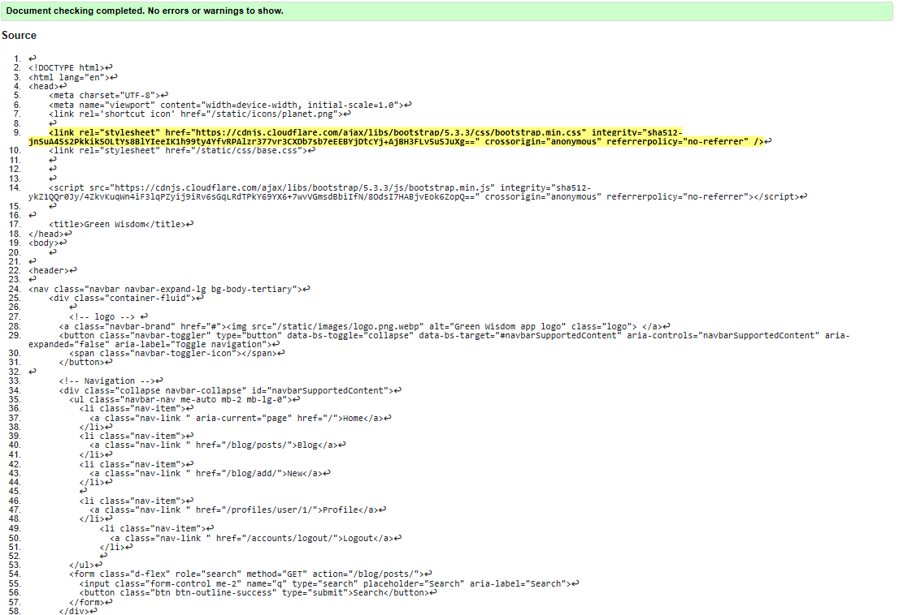
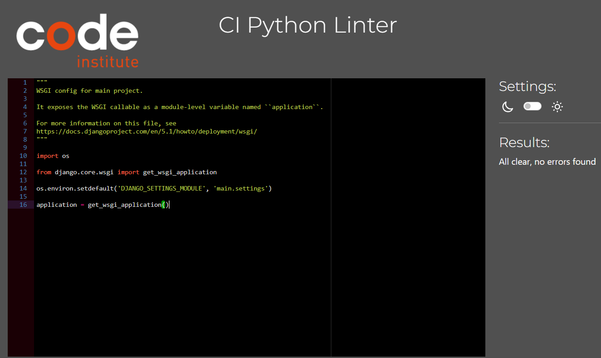

# TESTING.md

---

<h1 align="center"><strong>Green Wisdom</strong>

---

.png)

## [LIVE SITE](https://green-wisdom-99e0528945fb.herokuapp.com/)

## [GITHUB RESPOSITORY](https://github.com/Angela-Sin/Green_Wisdom)

## Table of Contents

- [Manual Testing](#manual-testing)
  - [User Stories Testing](#user-stories-testing)
- [Lighthouse Testing](#lighthouse-testing)
  - [Mobile Phone](#mobile-phone)
  - [Desctop](#desctop)
- [Code Validation](#code-validation)
  - [Html](#html)
  - [CSS](#css)
  - [Python](#python)
- [Browser Compatibility](#browser-compatibility)
- [Bugs Issue](#bugs-issue)

# Manual Testing
## User stories testing

| **User Story** | **Testing Method** | **Expected Outcome** | **Result** |
|---------------|-------------------|---------------------|------------|
| As a user, I want a simple navigation menu to find content easily. | Manual UI Testing | [Navigation](#common-elements-on-all-pages) is intuitive and accessible. | ✅ Pass |
| As a user, I want the navigation menu to be accessible on all devices. | Responsive Testing | [Navigation](#common-elements-on-all-pages) adjusts properly on different screen sizes. | ✅ Pass |
| As a user, I want to see social media links for community interaction. | Manual UI Testing | [Social media](#common-elements-on-all-pages) links are visible and clickable. | ✅ Pass |
| As a user, I want to register an account to access features. | Manual UI Testing | Registration form submits successfully and logs user in. | ✅ Pass |
| As a user, I want to log in and out of my account securely. | Manual UI Testing | Login and logout function correctly. | ✅ Pass |
| As a user, I want to browse and search for blog posts easily. | Functional Testing | [Search](#common-elements-on-all-pages) functionality works correctly. | ✅ Pass |
| As a user, I want to add new blog posts to share with others. | CRUD Testing | Blog post submission form functions correctly. | ✅ Pass |
| As a user, I want to edit my blog posts when needed. | CRUD Testing | Blog posts can be updated successfully. | ✅ Pass |
| As a user, I want to delete my own blog posts. | CRUD Testing | Users can remove their own blog posts. | ✅ Pass |
| As a user, I want clear content formatting for blog posts. | UI Testing | Blog post details page displays correctly. | ✅ Pass |
| As a user, I want to review and comment on blog posts. | Functional Testing | Comments can be added and displayed under the blog post. | ✅ Pass |
| As a user, I want a cancel button for delete and comment confirmations. | UI Testing | Cancel button works correctly. | ✅ Pass |
| As an admin, I want to manage user accounts and comments. | Admin Panel Testing | Admin can edit or delete user content. | ✅ Pass |

All tests were successfully completed, ensuring a seamless user experience across all functionalities. 

### Common Elements on All Pages
- **Navigation Bar**  
  The navigation bar provides easy and seamless access to different pages and stays fixed at the top of the page as you scroll.  
  The following links are included:
  - **Home** (Currently Active)
  - **Blog**
  - **New** (Create Post)
  - **Profile**
  - **Logout**
  - **Search Bar** (For quick search functionality)
    - User can search for posts by entering a keyword in the search bar. The search function looks for matches in the title, summary, content, and category of posts.

         - If a match is found, the relevant posts will be displayed.
         - If no keyword is entered, all posts will be shown.

- ## Responsive Navigation for Smaller Devices
  On tablets and smaller devices, the website uses a hamburger menu (☰) to improve navigation.

   - The menu is hidden by default and appears when the hamburger icon is clicked.
   - It includes links to Home, Blog, New, Register, and Login for easy access.
   - A search bar is placed below the menu, allowing users to quickly find content.

- **Sticky Footer**  
  The footer is fixed at the bottom of all pages and contains social media icons:
  - Facebook
  - GitHub
  - Instagram
  - YouTube

# Lighthouse 
## Mobile Phone

## Desktop

# Code validation
## [Html](https://validator.w3.org/)
### index.html

### posts.html

### post_detail.html

### profile.html

### edit_post.html

### blogpost_confirm_delete.html

### add_post.html

### add_comment.html

## CSS
## [CSS-Valitador](#https://jigsaw.w3.org/css-validator/)

# Python
## [pep8ci](#https://pep8ci.herokuapp.com/)

# Browser Compability

The site was tested across multiple browsers for consistency and responsiveness:

| Browser           | Result  |
|------------------|--------|
| 🌍 **Google Chrome**   | ✅ Pass  |
| 🦊 **Mozilla Firefox** | ✅ Pass  |
| 🎭 **Microsoft Edge**  | ✅ Pass  |
|🏴‍☠️ **Opera**            | ✅ Pass  |

The site maintains a **consistent design** and remains **fully responsive** across different browsers.

# Bug-Issue
## ISSUE #1 Deployment and Debugging Issues (Heroku, Cloudinary, and django-allauth)
### During the project setup and development, the following issues and resolutions were encountered:

Image Not Found (404 Error) in Admin Panel
After the initial setup, images were not loading in the admin panel, resulting in a 404 error. Updating the django-allauth and Django versions resolved this issue.

### 500 Error on Heroku After Modifying account.html

Locally, with DEBUG = True in settings.py, the application worked as expected.
However, deploying the changes to Heroku with DEBUG = False resulted in a 500 error. No error trace was visible in the terminal logs.
After updating django and django-allauth once again, the 500 error was resolved on Heroku.
Cloudinary Configuration Issue
A missing configuration in models.py related to Cloudinary was causing errors. Adding the correct command in models.py fixed the issue.
+from cloudinary_storage.storage import MediaCloudinaryStorage, +storage=MediaCloudinaryStorage(), =class BlogPost

## ISSUE #2
After upgrading texteditor reachtexteditor was changed to simple texteditor, so I lefted 4.14.0 with allert message.

## ADVISE 
By advise in #peer-code-review in **Slack** changed Like button for a fivicon. 

# Addition 

If a user tries to access the profile link with an account number (e.g., https://green-wisdom-99e0528945fb.herokuapp.com/profiles/user/1/) without logging in, they will encounter a 500 error. If they attempt to access the link without specifying an account number (e.g., https://green-wisdom-99e0528945fb.herokuapp.com/profiles/user/), they will be redirected to a 404 customer error page.
